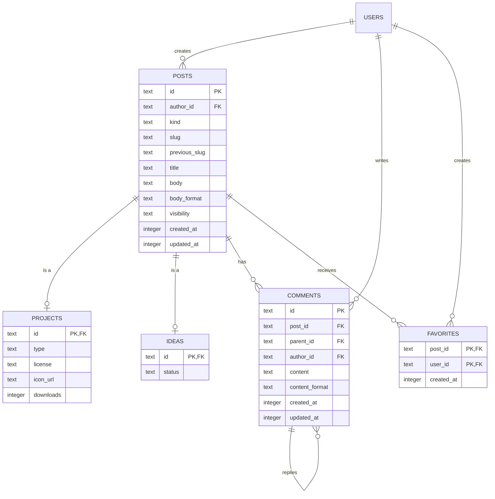

# システム設計: Postに関する再設計

本設計では、`Project`（プロジェクト）と`Idea`（アイデア）を共通の`Post`として扱うようにデータモデルを再設計する。

目的は以下の3つ。

- `Project`と`Idea`で重複している投稿情報を`posts`に集約する
- コメントやお気に入りを、Project・Ideaのどちらでも共通して利用できるようにする
- 今後、新しい投稿種別を追加しやすい構造にする

## 1. 基本的な考え方

`Post`は「投稿そのもの」を表す共通テーブルとする。

`Project`と`Idea`は、それぞれ固有の情報だけを持つ。

```text
                    Post
                     │
             ┌───────┴───────┐
             │               │
          Project           Idea
             │               │
             └───────┬───────┘
                     │
          ┌──────────┴──────────┐
          │                     │
       Comment              Favorite
```

例えば、ProjectとIdeaのどちらにも以下の情報が存在する。

- 投稿者
- タイトル（`projects.name` と `ideas.title`）
- 本文（`projects.description` と `ideas.content`）
- 本文の記法（`projects.description_format` と `ideas.content_format`）
- 公開範囲（`projects.status` と `ideas.visibility`）
- URL識別子（現状はProjectのみ`slug`を持つ）
- 作成日時
- 更新日時
- コメント
- お気に入り

これらは名前が違うだけで役割が同じなので、Project用・Idea用にそれぞれ持つのではなく`Post`に集約する。

一方で、Projectだけに必要な`license`や`downloads`、Ideaだけに必要な`status`（進行状態）などは、それぞれのテーブルに残す。

つまり、共通する情報はPost、固有の情報はProject / Idea、という分け方にする。

### テーブルは3つだが、エンティティは2つ

この設計では`posts` / `projects` / `ideas`の3テーブルができるが、投稿の種類が3つに増えるわけではない。`posts`は3つ目のエンティティではなく、オブジェクト指向でいう抽象クラスのフィールド置き場にあたる。

```java
abstract class Post    { String id; String title; String body; }
class Project extends Post { String license; int downloads; }
```

`Project`のインスタンスは1個だが、その中のフィールドは`Post`由来と`Project`由来の2グループに分かれている。RDBには継承の仕組みが無いため、この2グループを物理的に別テーブルへ置き、同じ`id`で結びつける。

```text
Project インスタンス 1個
        ↓
posts    (id = abc, title, body, ...)   ← Post 由来のフィールド
projects (id = abc, license, downloads) ← Project 由来のフィールド
```

オブジェクトの実体にあたるのは、JOINした結果のほうである。

```sql
SELECT * FROM posts
JOIN projects ON projects.id = posts.id
WHERE posts.id = 'abc';
-- これで Project インスタンス1個分になる
```

抽象クラスが単体でインスタンス化されないのと同じく、`posts`の行が子テーブルの対応行を持たずに存在してはいけない。これが[12. 実装上の注意点](#12-実装上の注意点)で扱う不変条件である。

TypeScriptの型で書くと、この関係は交差型になる。

```typescript
type ProjectPost = Post & { license: string; downloads: number };
type IdeaPost    = Post & { status: "open" | "in_progress" | "fulfilled" };
```

### なぜ1テーブルにまとめないのか

Postを共通の型として扱うなら、`posts`1枚に全カラムを入れる方法もある（Single Table Inheritance）。採らないのは、`projects`の固有カラムが多いため。

`license` / `downloads` / `modrinth_id` / `recipes_enabled`など約18カラムが、すべてのIdeaの行でNULLになる。それ以上に問題なのは、`license`はProjectには必須なのにテーブル上はNOT NULLを付けられなくなること。「Projectなら必ずある」という制約をDBで表現できなくなる。

逆に、`ideas`が`status`1カラムだけであることを理由に、`ideas`を廃止して`posts.status`をnullableにする案（2テーブル構成）も成り立つ。ただし同じ理由で「Ideaには必ずstatusがある」を強制できなくなり、Idea固有の項目を足す段階でテーブルを作り直すことになる。ここでは3テーブル構成を採る。

## 2. テーブル構成

最終的なテーブル構成は以下とする。

```text
posts
 ├── projects
 └── ideas

posts
 ├── comments
 └── favorites
```

### `posts`

ProjectとIdeaに共通する情報を持つ。

| カラム | 内容 |
| --- | --- |
| `id` | 投稿ID |
| `author_id` | 投稿者 |
| `kind` | `project` または `idea` |
| `slug` | URL識別子 |
| `previous_slug` | 変更前のslug（リダイレクト用） |
| `title` | タイトル |
| `body` | 本文 |
| `body_format` | 本文の記法（`markdown` / `plaintext` / `pukiwiki`） |
| `visibility` | `draft` / `public` / `unlisted` / `private` |
| `created_at` | 作成日時 |
| `updated_at` | 更新日時 |

各カラムの元になった既存カラムは以下の通り。

| `posts` | Project | Idea |
| --- | --- | --- |
| `slug` | `projects.slug` | なし（新規） |
| `previous_slug` | `projects.previous_slug` | なし（新規） |
| `title` | `projects.name` | `ideas.title` |
| `body` | `projects.description` | `ideas.content` |
| `body_format` | `projects.description_format` | `ideas.content_format` |
| `visibility` | `projects.status` | `ideas.visibility` |

`projects.description`はカード表示で切り詰められる短い説明文ではなく、`description_format`（markdown / pukiwiki）を伴う本文そのもの。`ideas.content`と役割が同じなので、`body`という名前に統一する。`description`のままだとIdeaの本文を指す名前として読みにくい。

`kind`という名前にしている理由は、既存の`projects.type`と衝突するため。JOINしたクエリに`type`が2つ現れると読み違えの原因になる。

### なぜ`kind`が必要か

`kind`は厳密には冗長なカラムである。`projects`と`ideas`のどちらに対応行があるかで種別は判別できるため、情報としては重複している。

それでも置くのは、一覧クエリを索引で引くため。`kind`が無い場合、Idea一覧はこう書くことになる。

```sql
SELECT * FROM posts
JOIN ideas ON ideas.id = posts.id
WHERE posts.visibility = 'public'
ORDER BY posts.created_at DESC LIMIT 20;
```

「Ideaであること」という条件がJOINから来るため、`ideas`を全件走査してから`posts`を引き、絞り込んでソートすることになる。索引で並び順を確定できないので、20件しか必要なくても毎回全件のソートが発生する。

`kind`があれば`(kind, visibility, created_at)`の複合索引がそのまま順序付きで効き、LIMITで途中打ち切りできる。プロフィールの投稿一覧のように種別を混ぜて出す画面でも、種別バッジの表示にJOINが要らなくなる。

また、後述する`(kind, slug)`の一意制約も、`kind`が同じ行に無ければ張れない。

代償として、`kind`は第二の真実になる。`kind = 'project'`なのに`ideas`に対応行がある、という矛盾をSQLiteは防げない。これは運用ルールで抑える。

- `kind`は作成時に子テーブルと同時に書き込む（[12. 実装上の注意点](#12-実装上の注意点)の`db.batch()`）
- 作成後は一切更新しない

Postの種別は後から変わらないため、この制約で実務上困ることはない。

### `type` と `status` が指しているもの

現状、似た名前のカラムが4つあり、それぞれ別のものを指している。この設計では名前を分けて整理する。

| 既存カラム | 意味 | 値 | 移行後 |
| --- | --- | --- | --- |
| `projects.type` | 配布物の種類 | `mod` / `plugin` / `resourcepack` / `datapack` / `shader` / `modpack` | `projects.type` のまま |
| `projects.status` | 公開範囲 | `draft` / `public` / `unlisted` / `private` | `posts.visibility` |
| `ideas.visibility` | 公開範囲 | `projects.status`と同じ | `posts.visibility` |
| `ideas.status` | アイデアの進行状態 | `open` / `in_progress` / `fulfilled` | `ideas.status` のまま |

`projects.status`と`ideas.status`は名前が同じなのに全く違うものを指していた。前者は公開範囲、後者は進行状態。ここを`visibility`と`status`に呼び分ける。

### slugをIdeaにも持たせる

現状Ideaのページは`/ideas/[id]`で、URLにランダムなIDが出る。`slug`を`posts`に持たせることで、Projectと同じ仕組みでURLを扱えるようになる。

ただしIdeaはProjectと違い、投稿時にslugを考えさせたくない。そこで次の方針にする。

- Ideaの`slug`は作成時にランダム値を自動で入れる。`id`と同じ値をそのまま使えばよい。この時点でURLは今までと変わらない
- 作者は後からslugを任意の文字列に変更できる（任意機能）
- 変更した場合、旧slugは`previous_slug`に退避され、Projectと同じリダイレクトが効く

これにより、Ideaにslugを必須にすることなく、設定したい人だけが設定できる。また既存Ideaの移行も`slug = id`を入れるだけで済み、日本語タイトルからslugを生成する必要がない。

一意制約は`slug`単体ではなく`(kind, slug)`の複合にする。単体だと、あるIdeaから生まれたProjectが同じslugを名乗れなくなるため。`projects.source_idea_id`があるようにIdea起点でProjectを作る流れが存在するので、この2つは同じ名前を取れたほうがよい。URLも`/projects/`と`/ideas/`で分かれているため衝突しない。

なおIdeaのルートは`/ideas/[id]`から`/ideas/[slug]`へ変わるが、初期値が`slug = id`なので既存URLはそのまま生き続ける。

### `projects`

Project固有の情報だけを持つ。

| カラム | 内容 |
| --- | --- |
| `id` | `posts.id`と同じ値 |
| `type` | `mod` / `plugin` / `resourcepack` など |
| `license` | ライセンス |
| `icon_url` | アイコン |
| `downloads` `total_downloads` `external_downloads` | ダウンロード数 |
| `source_url` `issue_tracker_url` `links` | 外部リンク |
| `modrinth_id` `curseforge_id` `github_repo` `discord_webhook_url` | 外部サービス連携 |
| `comments_enabled` `recipes_enabled` `recipe_namespaces` | 機能のON/OFF |
| `source_idea_id` | 元になったIdea |

slug・名前・本文・公開範囲が`posts`へ移るため、`projects`に残るのは配布物としての情報だけになる。

`projects.id`は`posts.id`を参照する。

つまり、

```text
posts
id = abc123
kind = project
slug = modparks
title = ModParks
body = ...
visibility = public
author_id = user1

projects
id = abc123
type = mod
license = MIT
downloads = 1200
```

という関係になる。

### `ideas`

Idea固有の情報だけを持つ。

| カラム | 内容 |
| --- | --- |
| `id` | `posts.id`と同じ値 |
| `status` | `open` / `in_progress` / `fulfilled` |

タイトルと本文が`posts`へ移るため、`ideas`に残るのは進行状態だけになる。`status`はアイデアの進行状態であり、`posts.visibility`（公開範囲）とは別物なので`ideas`側に残す。

例えば、

```text
posts
id = xyz789
kind = idea
slug = want-recipe-viewer
title = ModParksに○○機能が欲しい
body = ...
visibility = public
author_id = user2

ideas
id = xyz789
status = open
```

となる。

`ideas`がカラム1つのテーブルになることに違和感があるかもしれないが、テーブル自体は残す。Idea固有の項目（採用理由、対応バージョンなど）を後から足す場所が必要であり、また`kind = "idea"`のPostに必ず対応行が存在するという構造を崩さないため。

## 3. なぜPostを分離するのか

従来の構造では、ProjectとIdeaがそれぞれ投稿情報を持っていた。

```text
projects
 ├── id
 ├── author_id
 ├── name
 ├── description
 ├── description_format
 ├── status          ← 公開範囲
 ├── created_at
 ├── updated_at
 └── ...

ideas
 ├── id
 ├── author_id
 ├── title           ← name と同じ役割
 ├── content         ← description と同じ役割
 ├── content_format  ← description_format と同じ役割
 ├── visibility      ← status と同じ役割
 ├── created_at
 ├── updated_at
 └── ...
```

この構造では、役割が同じ情報が別々の名前で2つのテーブルに存在する。名前が違うため、共通の処理を書こうとするたびに変換が必要になる。

さらにコメントも、

```text
project_comments
idea_comments
```

のように分かれてしまう。

これをPost中心にすると、

```text
posts
 ├── id
 ├── author_id
 ├── kind
 ├── slug
 ├── title
 ├── body
 ├── body_format
 ├── visibility
 ├── created_at
 └── updated_at

projects
 ├── id
 └── type / license / downloads など

ideas
 ├── id
 └── status

comments
 └── post_id

favorites
 └── post_id
```

となる。

共通情報を1箇所に集約できるため、同じ構造を何度も定義する必要がなくなる。

例えば「タイトルと本文を表示する」「本文を記法に応じてレンダリングする」「公開範囲で絞り込む」といった処理は、すべて`posts`だけを見れば書ける。ProjectとIdeaで別々に実装する必要がなくなる。

## 4. Project / IdeaとPostの関係

`Project`と`Idea`は、DB上では`Post`と1:1で対応する。

```text
posts
  │
  │ 1:1
  ├──────── projects
  │
  │ 1:1
  └──────── ideas
```

`posts.kind`によって、どの種類のPostなのかを判別する。

```text
kind = project
    ↓
posts + projects

kind = idea
    ↓
posts + ideas
```

このため、ProjectとIdeaで共通の処理を行う場合は`posts`を利用できる。

例えば「投稿者が作成した投稿一覧」を取得する場合、

```sql
SELECT *
FROM posts
WHERE author_id = ?;
```

だけでProjectとIdeaの両方を取得できる。

一方、Project固有の情報が必要になった場合は`projects`とJOINする。

```sql
SELECT *
FROM posts
JOIN projects ON projects.id = posts.id
WHERE posts.id = ?;
```

## 5. コメント

コメントはProjectとIdeaで分けず、`comments`に統一する。

```text
comments
 ├── id
 ├── post_id
 ├── parent_id
 ├── author_id
 ├── content
 ├── content_format
 ├── created_at
 └── updated_at
```

`post_id`から対象のPostを指定する。

```text
Project
   ↓
posts.id = abc
   ↓
comments.post_id = abc


Idea
   ↓
posts.id = xyz
   ↓
comments.post_id = xyz
```

これにより、`project_comments`と`idea_comments`という重複したテーブルは不要になる。

また、`parent_id`を利用することでコメントへの返信も同じテーブルで管理できる。

## 6. お気に入り

「いいね」と「ブックマーク」は別の機能として扱わず、お気に入りに統一する。UI上のアイコンもブックマークのアイコンを使う。

そのため、専用の`favorites`テーブルを用意する。区別が不要なので`type`カラムは持たない。

```text
favorites
 ├── post_id
 ├── user_id
 └── created_at
```

`user_id`と`post_id`の組み合わせをPrimary Keyとする。

```text
(user_id, post_id) = 1組につき1件
```

これにより、同じユーザーが同じPostを何度もお気に入り登録することを防ぐ。

```text
User A ── Favorite ── Post 1
User A ── Favorite ── Post 2
User B ── Favorite ── Post 1
User C ── Favorite ── Post 1
```

これはユーザーとPostの多対多の関係になる。

```text
users
  │
  │ N
  ▼
favorites
  ▲
  │ N
  │
posts
```

## 7. 最終的なER構造



## 8. Drizzleスキーマ

```typescript
export const posts = sqliteTable("posts", {
  id: text("id").primaryKey(),

  authorId: text("author_id")
    .notNull()
    .references(() => users.id, { onDelete: "cascade" }),

  kind: text("kind", {
    enum: ["project", "idea"],
  }).notNull(),

  /** URL識別子。Idea は作成時 id と同じランダム値を入れ、後から変更できる */
  slug: text("slug").notNull(),
  /** 変更前の slug。リダイレクト用 */
  previousSlug: text("previous_slug"),

  title: text("title").notNull(),
  body: text("body").notNull(),

  bodyFormat: text("body_format", {
    enum: ["markdown", "plaintext", "pukiwiki"],
  })
    .notNull()
    .default("markdown"),

  visibility: text("visibility", {
    enum: ["draft", "public", "unlisted", "private"],
  })
    .notNull()
    .default("draft"),

  createdAt: integer("created_at", { mode: "timestamp" })
    .notNull()
    .default(sql`(unixepoch())`),

  updatedAt: integer("updated_at", { mode: "timestamp" })
    .notNull()
    .default(sql`(unixepoch())`),
}, (t) => ({
  // slug は種別ごとに一意。Idea 発の Project が同じ slug を名乗れるようにする
  slugUnique: uniqueIndex("posts_kind_slug_unique").on(t.kind, t.slug),
  previousSlugIdx: uniqueIndex("posts_kind_previous_slug_unique")
    .on(t.kind, t.previousSlug),
  authorIdx: index("posts_author_idx").on(t.authorId),
  // 一覧は「種別 + 公開範囲」で絞って新しい順に並べるため、複合索引にする
  kindVisibilityCreatedIdx: index("posts_kind_visibility_created_idx")
    .on(t.kind, t.visibility, t.createdAt),
  updatedAtIdx: index("posts_updated_at_idx").on(t.updatedAt),
}));
```

既存の`projects`にあった`projects_author_idx` / `projects_status_idx` / `projects_created_at_idx` / `projects_updated_at_idx`と、`slug` / `previous_slug`の一意制約は、対象カラムが`posts`へ移るため`posts`側の索引に置き換わる。`projects_type_idx`と`projects_downloads_idx`は`projects`に残す。

SQLiteの一意索引はNULLを重複とみなさないため、`previous_slug`がNULLの行が複数あっても問題ない。

```typescript
export const projects = sqliteTable("projects", {
  id: text("id")
    .primaryKey()
    .references(() => posts.id, { onDelete: "cascade" }),

  type: text("type", {
    enum: ["mod", "plugin", "resourcepack", "datapack", "shader", "modpack"],
  }).notNull(),

  // license / iconUrl / downloads など、既存の Project 固有カラムはそのまま残す
}, (t) => ({
  typeIdx: index("projects_type_idx").on(t.type),
  downloadsIdx: index("projects_downloads_idx").on(t.downloads),
}));
```

```typescript
export const ideas = sqliteTable("ideas", {
  id: text("id")
    .primaryKey()
    .references(() => posts.id, { onDelete: "cascade" }),

  status: text("status", {
    enum: ["open", "in_progress", "fulfilled"],
  })
    .notNull()
    .default("open"),
}, (t) => ({
  statusIdx: index("ideas_status_idx").on(t.status),
}));
```

```typescript
export const comments = sqliteTable("comments", {
  id: text("id").primaryKey(),

  postId: text("post_id")
    .notNull()
    .references(() => posts.id, { onDelete: "cascade" }),

  parentId: text("parent_id"),

  authorId: text("author_id")
    .notNull()
    .references(() => users.id, { onDelete: "cascade" }),

  content: text("content").notNull(),

  contentFormat: text("content_format", {
    enum: ["markdown", "plaintext", "pukiwiki"],
  })
    .notNull()
    .default("markdown"),

  createdAt: integer("created_at", { mode: "timestamp" })
    .notNull()
    .default(sql`(unixepoch())`),

  updatedAt: integer("updated_at", { mode: "timestamp" })
    .notNull()
    .default(sql`(unixepoch())`),
}, (t) => ({
  postIdx: index("comments_post_idx").on(t.postId),
  authorIdx: index("comments_author_idx").on(t.authorId),
}));
```

```typescript
export const favorites = sqliteTable(
  "favorites",
  {
    postId: text("post_id")
      .notNull()
      .references(() => posts.id, { onDelete: "cascade" }),

    userId: text("user_id")
      .notNull()
      .references(() => users.id, { onDelete: "cascade" }),

    createdAt: integer("created_at", { mode: "timestamp" })
      .notNull()
      .default(sql`(unixepoch())`),
  },
  (table) => ({
    pk: primaryKey({
      columns: [table.postId, table.userId],
    }),
    postIdx: index("favorites_post_idx").on(table.postId),
    userIdx: index("favorites_user_idx").on(table.userId),
  }),
);
```

## 9. TypeScriptの型設計

この再設計はDBだけの話ではない。アプリ側のドメインモデルも同じ形に組み直す。

### 9.1. 基本の型

DBの行に対応する型は、Drizzleの`$inferSelect`から導出する。手書きしない。

```typescript
// db/schema.ts
export type Post          = typeof posts.$inferSelect;
export type ProjectFields = typeof projects.$inferSelect;
export type IdeaFields    = typeof ideas.$inferSelect;
export type Comment       = typeof comments.$inferSelect;
export type Favorite      = typeof favorites.$inferSelect;
```

`ProjectFields` / `IdeaFields`という名前にしているのは、これらが単体で「Project」を表さないため。`projects`の行だけでは`title`も`author`も無く、オブジェクトとして不完全である。単体で使う機会はほぼ無い。

### 9.2. 合成した型

実際にアプリが扱うのは、親子を結合した形。

```typescript
// types/post.ts
import type { Post, ProjectFields, IdeaFields } from "@/db/schema";

export type ProjectPost = Post & { kind: "project" } & Omit<ProjectFields, "id">;
export type IdeaPost    = Post & { kind: "idea" }    & Omit<IdeaFields, "id">;

export type AnyPost = ProjectPost | IdeaPost;
```

`Omit<..., "id">`で子側の`id`を落としているのは、`Post`の`id`と同じ値であり、2つ書く意味が無いため。

`kind`をリテラル型で固定しているのが要点で、これにより`AnyPost`が判別可能ユニオンになる。TypeScriptが`kind`を見て自動的に型を絞り込む。

```typescript
function render(post: AnyPost) {
  // ここでは post.title / post.body は使える（Post 共通）
  console.log(post.title);

  if (post.kind === "project") {
    console.log(post.license);  // ProjectPost に絞り込まれる
  } else {
    console.log(post.status);   // IdeaPost に絞り込まれる
  }
}
```

`post.license`をIdeaの分岐で書くとコンパイルエラーになる。DBで表現できなかった「Projectにしかlicenseは無い」という制約を、型で守れる。

型ガードを用意しておくと、配列の絞り込みでも使える。

```typescript
export const isProjectPost = (p: AnyPost): p is ProjectPost => p.kind === "project";
export const isIdeaPost    = (p: AnyPost): p is IdeaPost    => p.kind === "idea";

const projects = posts.filter(isProjectPost);  // ProjectPost[] になる
```

### 9.3. 表示用の型

一覧やページ表示では、投稿者の情報とお気に入り数を一緒に返すことが多い。これらは`posts`の行には無いので、別の型として定義する。

```typescript
export interface PostAuthor {
  id: string;
  username: string;
  displayName: string | null;
  avatarUrl: string | null;
}

export type PostView<T extends AnyPost = AnyPost> = T & {
  author: PostAuthor;
  favoriteCount: number;
  commentCount: number;
  /** 閲覧者がお気に入り登録済みか。未ログインなら false */
  isFavorited: boolean;
};
```

`PostView<ProjectPost>`と書けばProjectの表示用型になり、`PostView`単体なら両方を受け取れる。コンポーネントの`props`はこの型を使う。

`Comment`も同様に、表示には投稿者情報が要る。

```typescript
export type CommentView = Comment & {
  author: PostAuthor;
  replies: CommentView[];
};
```

### 9.4. 既存の型定義の置き換え

現在`db/schema.ts`が公開している以下の型は、意味が変わるか消滅する。

現在`db/schema.ts`が公開している型は、以下のように置き換える。

| 現在の型 | 移行後 | 備考 |
| --- | --- | --- |
| `Project` | `ProjectPost` | `typeof projects.$inferSelect`は`ProjectFields`へ改名 |
| `Idea` | `IdeaPost` | `typeof ideas.$inferSelect`は`IdeaFields`へ改名 |
| `ProjectComment` | `Comment` | 統合 |
| `IdeaComment` | `Comment` | 統合 |

### 旧名を残さない

`Project`という名前は再利用せず、必ず`ProjectPost`へ改名する。これは移行漏れを機械的に検出するための措置である。

`project.name`は`post.title`へ、`project.description`は`post.body`へ変わる。もし`Project`という型名を残したまま中身だけ差し替えると、次のような箇所がコンパイルエラーにならずに残る。

```typescript
// Project 型を維持した場合、この関数のシグネチャは変わらない
function renderCard(project: Project) {
  return project.name;  // ← name が消えているのでここはエラーになる
}

// しかし、こういう箇所はすり抜ける
const list: Project[] = await fetchProjects();  // 型は合うが中身が別物
```

型名ごと変えれば、`Project`を参照しているファイルがすべて「そんな型は無い」というエラーになる。1つずつ潰していけば、見落としが構造的に発生しない。

改名の影響範囲は次の通り。

```text
Project        102 ファイル
Idea            26 ファイル
ProjectComment   2 ファイル
IdeaComment      2 ファイル
```

`Project`は102ファイルに及ぶため作業量は大きいが、これはもともと`project.name`の参照箇所を全部確認しなければならない作業であり、コンパイラに列挙させるほうが確実に速い。

なお上記の件数には、ローカル変数名やコメント中の`Project`も含まれる。実際に型として参照しているのは`@/db/schema`から型をimportしている19ファイルが中心となる。

### 9.5. 公開APIの型は変えない

[types/api.ts](../types/api.ts)の`ApiProject` / `ApiIdea`は外部に公開しているREST APIの契約であり、内部のリファクタリングで壊してはいけない。

```typescript
export interface ApiProject {
  name: string;         // ← 内部は post.title
  description: string;  // ← 内部は post.body
  ...
}

export interface ApiIdea {
  title: string;        // ← 内部は post.title
  content: string;      // ← 内部は post.body
  ...
}
```

内部で`title` / `body`に統一しても、APIレスポンスは今の名前のまま返す。変換はAPIハンドラの境界で行う。

```typescript
function toApiProject(post: PostView<ProjectPost>): ApiProject {
  return {
    id: post.id,
    slug: post.slug,
    name: post.title,
    description: post.body,
    type: post.type,
    license: post.license,
    ...
  };
}
```

この変換関数を置くことで、内部のカラム名を今後変えてもAPIの互換性を保てる。逆に変換を挟まず`post`をそのまま返すと、内部の都合が外部契約に漏れる。

### 9.6. UIコンポーネントの構成

レイヤーは2つに分ける。

1つ目は表示を担当するCoreコンポーネント。`PostView`や`CommentView`を受け取り、`onSubmitComment`や`onEditComment`といった汎用的なコールバックだけを外に出す。例えば`CommentSection`は`comments: CommentView[]`を受け取るだけで、それがProjectのものかIdeaのものかは知らない。

タイトルと本文が`Post`に載ったことで、Coreコンポーネントの担当範囲は広がる。投稿ヘッダー（タイトル・投稿者・日時）、本文レンダリング（`bodyFormat`に応じた記法の切り替え）、お気に入りボタン、コメント欄までを`Post`だけで組み立てられる。ProjectとIdeaで別々のページコンポーネントを持つ必要がなくなり、違いはProject固有の情報（バージョン一覧、ダウンロード、依存関係）をどこに差し込むかだけになる。

2つ目はデータ取得を担当するAdapterコンポーネント。Project / Ideaに固有のデータ取得やServer Actionsの呼び出しを行い、その結果をCoreコンポーネントが受け取れる形に変換して渡す。例えば`ProjectComments`は`/api/v1/projects/[slug]/comments`から取得したデータを`CommentSection`へ流し込む。

## 10. データ移行計画

### フェーズ0: ID衝突の事前確認

この移行は、これまで別々のキー空間だった`projects.id`と`ideas.id`を`posts.id`という1つのキー空間に合流させる。同様に`project_comments.id`と`idea_comments.id`も`comments.id`に合流する。

そのため、移行前に必ず衝突がないことを確認する。1件でも当たれば、バックフィルは主キー制約で途中失敗する。

```sql
SELECT COUNT(*) FROM projects WHERE id IN (SELECT id FROM ideas);
SELECT COUNT(*) FROM project_comments WHERE id IN (SELECT id FROM idea_comments);
```

どちらも0であることを確認してから次へ進む。0でなければ、片方のIDに接頭辞を付けるなどの再採番を先に行う。

### フェーズ1: 新規テーブルの作成

`posts`テーブル、統一した`comments`テーブル、`favorites`テーブルを作成する。

そのうえで、`projects`と`ideas`の主キーを`posts.id`への外部キー参照に変更する。SQLiteは既存カラムへの外部キー追加ができないため、Drizzleが生成する移行はテーブルの再作成（新テーブル作成 → コピー → 旧削除 → リネーム）になる。

このとき、`projects`を参照している以下のテーブルも一緒に張り直しの影響を受けるため、移行SQLを目視で確認する。

```text
versions
project_categories
project_tags
project_dependencies
project_members
project_favorites
project_media
project_hidden_recipes
collection_items
reports
project_comments
project_subscriptions
```

移行スクリプト実行中は`PRAGMA foreign_keys=OFF`が必要になる。D1では`PRAGMA defer_foreign_keys=on`をトランザクション内で使う。

### フェーズ2: データのバックフィル

新しい構造へ既存データを流し込む。`projects.status`と`ideas.visibility`は、どちらも`posts.visibility`へ寄せる。

```sql
-- 1. projects から posts へバックフィル
INSERT INTO posts (id, author_id, kind, slug, previous_slug,
                   title, body, body_format, visibility, created_at, updated_at)
SELECT id, author_id, 'project', slug, previous_slug,
       name, description, description_format, status, created_at, updated_at
FROM projects;

-- 2. ideas から posts へバックフィル
--    slug は既存 URL を保つため id をそのまま入れる
INSERT INTO posts (id, author_id, kind, slug, previous_slug,
                   title, body, body_format, visibility, created_at, updated_at)
SELECT id, author_id, 'idea', id, NULL,
       title, content, content_format, visibility, created_at, updated_at
FROM ideas;

-- 3. project_comments から新 comments へバックフィル
INSERT INTO comments (id, post_id, parent_id, author_id, content, content_format, created_at, updated_at)
SELECT id, project_id, parent_id, author_id, content, content_format, created_at, updated_at FROM project_comments;

-- 4. idea_comments から新 comments へバックフィル
INSERT INTO comments (id, post_id, parent_id, author_id, content, content_format, created_at, updated_at)
SELECT id, idea_id, parent_id, author_id, content, content_format, created_at, updated_at FROM idea_comments;

-- 5. project_favorites から favorites へバックフィル
INSERT INTO favorites (post_id, user_id, created_at)
SELECT project_id, user_id, created_at FROM project_favorites;

-- 6. idea_likes から favorites へバックフィル
--    idea_likes には created_at カラムが無いため、現在時刻で補う
INSERT INTO favorites (post_id, user_id, created_at)
SELECT idea_id, user_id, unixepoch() FROM idea_likes;
```

`project_favorites`の移行は忘れやすい。「いいね」だけでなく既存の「お気に入り」も統合対象である点に注意する。

バックフィル後、`projects`から`slug` / `previous_slug` / `name` / `description` / `description_format` / `status` / `author_id` / `created_at` / `updated_at`を、`ideas`から`title` / `content` / `content_format` / `visibility` / `author_id` / `created_at` / `updated_at`を落とす。落とすのは、値が`posts`へ完全に移ったことを確認してからにする。

バックフィル後、件数が一致することを確認する。

```sql
SELECT (SELECT COUNT(*) FROM projects) + (SELECT COUNT(*) FROM ideas) AS src,
       (SELECT COUNT(*) FROM posts) AS dst;
```

### フェーズ3: コードの切り替えと旧テーブルの削除

バックエンドのエンドポイント、クエリ、Server Actionsの参照先を`posts`・`comments`・`favorites`へ切り替える。

あわせて以下も更新が必要になる。

`lib/backup/schemaConfig.ts`の`SCHEMA_TABLES`と`TABLE_RESTORE_ORDER`に`posts` / `comments` / `favorites`を追加し、旧3テーブルを外す。復元順は外部キーの向きに従い、`users`の後、`projects`と`ideas`の前に`posts`を置く。

```text
users
  ↓
posts
  ↓
projects / ideas
  ↓
comments / favorites
```

`notifications.type`の`idea_like`と`project_favorite`は、お気に入りに統一するため`favorite`へ寄せる。既存行の値も更新する。

`profile_pins`は`(item_type, item_id)`で多相参照している。`posts`ができたことで`post_id`1本にまとめられるので、この移行に合わせて整理する。

Ideaのルートを`/ideas/[id]`から`/ideas/[slug]`へ変更する。初期値が`slug = id`なので既存URLはそのまま解決できる。取得クエリはProjectと同じく`slug`と`previous_slug`の両方を見る形にする（[projectQuery.ts:110](../lib/actions/projectQuery.ts#L110) と同じ書き方）。

`projects.description`を参照している箇所（カード表示の`toPlainDescription`など）は`posts.body`へ向け先を変える。

ビルドと実行時の整合性を確認したうえで、不要になった`project_comments`・`idea_comments`・`idea_likes`・`project_favorites`を削除する。

## 11. 設計上のルール

この設計では、以下を基本ルールとする。

- Postには共通情報だけを置く
- Project / Ideaには、それぞれの種類に固有の情報だけを置く
- Postに対して行われる共通アクションは、Postを参照する関連テーブルで管理する

そのため、Project専用コメントやIdea専用コメントのようなテーブルは作らない。

同様に、Project専用お気に入りやIdea専用お気に入りも作らない。

すべて`post_id`を通してPostに紐付ける。

これによって、データベース上の重複を減らしながら、ProjectとIdeaを同じ「投稿」として扱える構造にする。

## 12. 実装上の注意点

### 親だけが残る状態を防ぐ

`posts.kind = "project"`なのに`projects`に対応する行が存在しない、という状態は、SQLiteの通常の外部キー制約だけでは防げない。

つまり、

```text
posts
id: A
kind: project
```

だけが作れてしまう。

そのため実装時は、Post作成と子テーブルの作成を必ず1回の書き込み単位にまとめる。

逆に`projects`を作るときは`posts`が先に存在している必要があるので、そちらは外部キーで保証できる。

### D1では`transaction()`が使えない

本プロジェクトはCloudflare D1を使っている。D1はインタラクティブなトランザクションに対応しておらず、Drizzleの`db.transaction()`は実行時に失敗する。

原子性を担保する手段は`db.batch()`で、これは全文が1トランザクションとして実行される。実際、既存コードでもバッチ書き込みは`db.batch()`で書かれている（[versionRecord.ts:50](../lib/utils/versionRecord.ts#L50)、[backupImport.ts:181](../lib/backup/backupImport.ts#L181)）。

したがってPost作成は次のように書く。

```typescript
const postId = crypto.randomUUID();

await db.batch([
  db.insert(posts).values({
    id: postId,
    authorId,
    kind: "project",
    slug,
    title,
    body,
    bodyFormat: "markdown",
    visibility: "draft",
  }),
  db.insert(projects).values({
    id: postId,
    type,
    license,
  }),
]);
```

Ideaの場合、`slug`には`postId`をそのまま入れる。

```typescript
const postId = crypto.randomUUID();

await db.batch([
  db.insert(posts).values({
    id: postId,
    authorId,
    kind: "idea",
    slug: postId,
    title,
    body,
    bodyFormat: "markdown",
    visibility: "draft",
  }),
  db.insert(ideas).values({
    id: postId,
    status: "open",
  }),
]);
```

IDはアプリ側で先に採番し、親子の両方に同じ値を入れる。`db.batch()`は配列の順に実行されるため、外部キーの向き（posts → projects）とも矛盾しない。

削除については、`projects`側に`onDelete: "cascade"`が張ってあるので`posts`を消せば子も消える。逆向き（`projects`だけを消す）は`posts`に孤児を残すため、削除は必ず`posts`に対して行う。

## 13. 拡張性

新しいPost種別を追加する場合、`posts`に対して子テーブルを1つ増やすだけでよい。

```text
posts
  │
  ├── projects
  ├── ideas
  └── updates
```

`comments`や`favorites`は変更する必要がない。

また、`profile_pins`のように「ProjectとIdeaのどちらも指しうる」ために外部キーを張れなかったテーブルも、`post_id`で参照できるようになるため外部キーで守れるようになる。

## 14. 他テーブルへの影響一覧

現行スキーマの全テーブルについて、この移行の影響を確認した結果を記す。

### 廃止して統合するもの

| テーブル | 統合先 |
| --- | --- |
| `project_comments` | `comments` |
| `idea_comments` | `comments` |
| `project_favorites` | `favorites` |
| `idea_likes` | `favorites` |

### 構造の変更が必要なもの

| テーブル | 変更内容 |
| --- | --- |
| `projects` | slug / name / description / description_format / status / author_id / created_at / updated_at を`posts`へ移す。`id`は`posts.id`を参照 |
| `ideas` | title / content / content_format / visibility / author_id / created_at / updated_at を`posts`へ移す。`id`は`posts.id`を参照 |
| `profile_pins` | `(item_type, item_id)`の多相参照を`post_id`1本にまとめ、外部キーを張る |
| `notifications` | `type`の`project_comment` / `idea_comment`を`comment`に、`idea_like` / `project_favorite`を`favorite`に統合。`payload`の`projectSlug`は`slug`へ寄せる |
| `moderation_audit` | `action`の`project_unpublish`は、Ideaも非公開にできるようになるため`post_unpublish`へ改名を検討 |
| `user_settings` | `default_project_status`は`posts.visibility`と同じ値域なので、`default_visibility`へ改名して整合を取る |
| `deleted_records` | `record_key`は複合主キーを":"で連結した文字列。`project_favorites`の`"projectId:userId"`が`favorites`の`"postId:userId"`に変わるため、旧形式の墓標が残っていると照合できなくなる |

### 参照先を`projects` / `ideas`のまま据え置くもの

以下は配布物やアイデアに固有の関連であり、`posts`へ付け替える必要はない。`projects.id`と`posts.id`は同じ値なので、参照は今のまま機能する。

```text
versions / version_loaders / version_mc_versions
project_categories / project_tags / project_dependencies
project_members / project_media / project_hidden_recipes
collection_items / project_subscriptions
version_ideas
```

ただし`projects`はテーブル再作成を伴うため、これらの外部キーは張り直しの影響を受ける。移行SQLの目視確認が必要（[10. データ移行計画](#10-データ移行計画)のフェーズ1）。

`projects.source_idea_id`は現在外部キーが無いが、`posts.id`への参照として張れるようになる。

### 影響を受けないもの

```text
users / user_profiles / account / session / verificationToken
authenticator / api_keys / password_reset_tokens / rate_limits
categories / tags / platforms
collections / user_follows / collection_follows / developer_subscriptions
push_subscriptions / scan_appeals / reports
settings_audit / backup_audit / ddos_slices / ddos_state
```

### バックアップ設定の更新

[schemaConfig.ts](../lib/backup/schemaConfig.ts)の`SCHEMA_TABLES`と`TABLE_RESTORE_ORDER`に加え、[mergePolicy.ts](../lib/backup/mergePolicy.ts)の`MERGE_POLICIES`も更新が必要。

ここに移行で壊れる箇所がある。現在`projects`と`ideas`は`last_write_wins`（更新日時が新しい方を採用）に分類されているが、その根拠は「`updated_at`を持つ」ことだった。移行後、`updated_at`は`posts`へ移るため、`projects`と`ideas`は`updated_at`を持たなくなり`last_write_wins`が成立しなくなる。

```text
posts    : updated_at を持つ  → last_write_wins
projects : updated_at が無い  → 従来の方針が使えない
ideas    : updated_at が無い  → 従来の方針が使えない
comments : updated_at を持つ  → last_write_wins（従来通り）
favorites: updated_at が無い  → insert_missing
```

`projects`と`ideas`は、親の`posts`の判定結果に追随させる必要がある。親が採用された場合のみ子も上書きする、という親子連動のポリシーを新設する。

### 判断が必要な論点

`posts`ができたことで「Projectだけの機能」をIdeaにも広げられるようになる。ただしこの移行に含めるかは別の判断であり、含めない場合は参照先を`projects`のまま据え置く。

| 対象 | 論点 |
| --- | --- |
| `reports` | 現在は`project_id`でProjectしか通報できない。`post_id`にすればIdeaも通報対象にできる |
| `project_subscriptions` | Ideaの更新通知を購読できるようにするなら`post_id`へ |
| `collection_items` | コレクションにIdeaを入れられるようにするなら`post_id`へ |
| `project_tags` | Ideaにタグを付けられるようにするなら`post_id`へ |
| `project_media` | Ideaにスクリーンショットを添付できるようにするなら`post_id`へ |
| `project_members` | Ideaに共同編集者の概念を持たせるか。現状は不要と判断 |

いずれもこの移行の必須項目ではない。まずは`posts` / `comments` / `favorites`の統合を完了させ、これらは個別に検討する。
